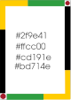
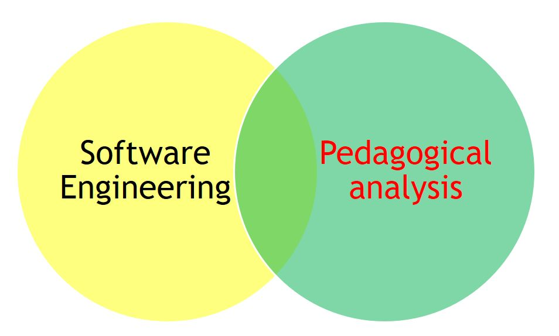

# LOGADO

Esse repositório contém a escrita da dissertação e da apresentação para a qualificação no mestrado em Computação Aplicada - PPGCA - UTFPR-CT

# Logado

Uma extensão para o Visual Studio Code projetada para apoiar pesquisas no ensino de programação. Ela coleta dados objetivos do processo de codificação ao monitorar, em tempo real, o uso de *palavras reservadas* da linguagem de programação.

Para cada ocorrência, a extensão registra um log estruturado contendo:
*   A *palavra reservada* digitada.
*   O *timestamp* (data e hora) do evento.
*   A *linha* e *coluna* no código.
*   O *nome do arquivo* em que a digitação ocorreu.

Esses dados agregados permitem a análise de padrões, estratégias de resolução de problemas e dificuldades comuns dos estudantes.

*Disponibilidade:* A extensão pode ser instalada diretamente através do Marketplace de Extensões do VS Code. O código-fonte completo está disponível publicamente no [GitHub](https://github.com/gilmargn/logado-utfpr-ifam) para verificação, contribuição e replicação da pesquisa.

## Características

A principal funcionalidade do Logado é a coleta e agrupamento de *rastros de aprendizagem* durante a programação:

*   *Coleta Automática e Passiva*: A captura de dados ocorre em segundo plano, sem interromper o fluxo de trabalho do estudante.
*   *Logs Estruturados*: Os dados são registrados em um formato consistente (como JSON) para facilitar a análise posterior.
*   *Metadados Ricos*: Cada evento é contextualizado com informações de tempo, localização no código e identificador do arquivo.
*   *Foco em Palavras Reservadas*: A captura se concentra em elementos sintáticos centrais (como if, for, while, function), que são indicadores claros do uso de conceitos de programação.

